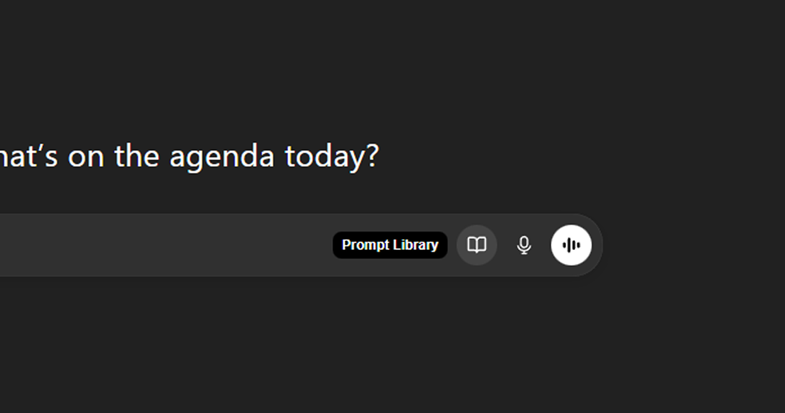

# Prompt Library

A browser extension for saving and inserting reusable prompts directly into AI chat interfaces like ChatGPT.

It adds a small, native-feeling UI to the chat input, so you can insert prompts without switching tabs or breaking context.



---

## Features

- One-click prompt insertion directly into the chat input
- UI automatically matches light/dark mode of the host site
- Prompts stored locally
- Built-in update checker with changelog
- Modular provider system for supporting multiple AI platforms

---

## Tech Stack

- React 19 + TypeScript
- Redux Toolkit
- Vite + CRXJS
- Vanilla CSS (Shadow DOM)

---

## Development

```bash
git clone https://github.com/kndxiu/prompt-library.git
cd prompt-library
npm install
npm run dev
```

Load the `dist` folder via `chrome://extensions` with **Developer mode** enabled.

---

## Build

```bash
npm run build
```

---

## Project Structure

- **src/features** – Feature-specific logic
- **src/content** – Content scripts injected into host pages
- **src/shared** – Shared UI and utilities
- **src/store** – Global state
- **src/shared/sites/providers** – Site-specific adapters

---

## License

MIT © kndxiu
